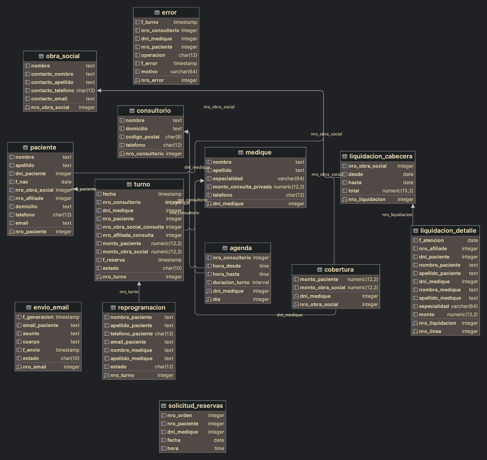

= Bases de Datos I: Trabajo Práctico
Agustín Lautaro Escobar <agustinesco@outlook.es>; Francisco Ruiz <franciscoruizlezcano@gmail.com>; Mariano Chun <marianochun01@gmail.com> v1, {docdate}. Docentes Daniel Bertaccini y Hernán Rondelli
:title-page:
:numbered:
:source-highlighter: coderay
:tabsize: 4

== Introducción
El objetivo del proyecto es desarrollar un sistema de administración de turnos médicos que permita asignar turnos correctamente, mantener la información de los pacientes, registrar las atenciones realizadas, administrar las liquidaciones mensuales de los médicos y enviar notificaciones por correo electrónico a los pacientes en diferentes situaciones (reserva de turno, cancelación, recordatorio, pérdida de turno). Además, se requiere la creación de la base de datos relacional con tablas específicas y la implementación de stored procedures y triggers para la lógica del sistema. También se solicita la comparación del modelo relacional con un modelo NoSQL, utilizando la base de datos BoltDB y almacenando los datos en formato JSON. El proyecto deberá poder ejecutarse desde una aplicación CLI escrita en Go.

== Descripción

=== Decisiones de diseño
Debido a que eramos varios personas desarrollando al mismo tiempo, decidimos utilizar una división de tareas y estructura de proyecto. Gracias a ello logramos una mejor organización y comunicación entre los miembros del equipo. Por otra parte, gracias a la lectura del contenido de archivos que nos provee el lenguaje, pudimos implementar toda la creación de bases de datos, datos, primary keys, foreign keys, stored procedures y triggers mediante archivos `.sql`. Esto nos permitió una mejor organización y mantenimiento de la base de datos.

=== Problemas encontrados
Durante el desarrollo del proyecto nos encontramos con varios problemas:

1. Para contextualizar mejor el dominio del problema que presenta el proyecto, realizamos un diagrama de Modelo Relacional, de tal forma de poder identificar correctamente las
relaciones entre las tablas y tener una idea de su cardinalidad.

2. Con el fin de popular las tablas de la base de datos, tuvimos que utlizar la herramienta https://www.mockaroo.com/[mockaroo] para generar datos aleatorios.

3. Encontramos un desafío al desarrollar los procedimientos almacenados para la generación de turnos disponibles y el envío de correos electrónicos. En una primera iteración, intentamos utilizar el método max(id) para obtener el valor máximo del identificador y luego sumarle 1. Sin embargo, decidimos cambiar nuestra aproximación y optamos por utilizar el tipo de datos serial para los identificadores de las tablas pertinentes.

4. Para inicializar la creación de la base de datos y su esquema pertinente, tuvimos que realizar dos conexiones a PostreSQL. La primera conexión se utilizó para crear la base de datos y la segunda para crear el esquema. Esto se debió a que en una misma conexión no encontramos la posibilidad de cambiar de esquema.

== Implementación

=== Estructura del proyecto
La estructuración del proyecto la consideramos esencial para organizar, planificar y desarrollar eficientemente la aplicación. Nos proporciona claridad, mejora la colaboración y la comunicación entre los miembros del equipo.

A continuación se muestra la estructura del proyecto:
[source, bash]
----
.
├── cmd
│   └── cli
├── internal
│   ├── db
│   ├── fk
│   ├── pk
│   ├── fk
│   ├── sp
│   ├── trigger
│   ├── appointment.go
│   ├── consultingroom.go
│   ├── insurance.go
│   └── patient.go
├── kit
├── nosql
├── sql
│   ├── data
│   ├── fk
│   ├── pk
│   ├── sp
│   ├── triggers
│   ├── schema.sql
│   └── database.sql
├── go.mod
└── go.sum
----

`/cmd`: Contiene todos los puntos de entrada e interacciones con el usuario de nuestra aplicación.

`/internal`: Contiene todos los componentes que consideramos core de nuestra aplicación.

`/kit`: Se encuentran funciones útiles que utilizamos en cualquier parte de la aplicación.

`/nosql`: Contiene los archivos necesarios para la gestión de la base de datos no relacional.

`/sql`: Contiene los archivos `.sql` necesarios para la creación de la base de datos, datos pre insertados, primary key, foreign key, stored procedures y triggers.

==== Comandos
Para ejecutar la aplicación CLI, se debe ejecutar el siguiente comando: `go run cmd/cli/main.go`

=== Diagrama del Modelo Relacional
.Diagrama del Modelo Relacional

=== Scripts
==== Creación de la base de datos y tablas
.Creación de la base de datos, ubicado en `sql/database.sql`
[source, postgresql]
----
include::sql/database.sql[]
----

.Creación del esquema de la base de datos, ubicado en `sql/schema.sql`
[source, postgresql]
----
include::sql/schema.sql[]
----

==== Primary Keys
.Creación de las PKs, ubicado en `sql/pk/create.sql`
[source, postgresql]
----
include::sql/pk/create.sql[]
----

.Eliminación de las PKs, ubicado en `sql/pk/remove.sql`
[source, postgresql]
----
include::sql/pk/remove.sql[]
----
==== Foreign Keys
.Creación de las FKs, ubicado en `sql/fk/create.sql`
[source, postgresql]
----
include::sql/fk/create.sql[]
----

.Eliminación de las FKs, ubicado en `sql/fk/remove.sql`
[source, postgresql]
----
include::sql/fk/remove.sql[]
----

==== Stored Procedures
.Atender turno, ubicado en `sql/sp/attend_appointment.sql`
[source, postgresql]
----
include::sql/sp/attend_appointment.sql[]
----

.Cancelar turno, ubicado en `sql/sp/cancel_appointment.sql`
[source, postgresql]
----
include::sql/sp/cancel_appointment.sql[]
----

.Crear turnos a partir de un año y mes, ubicado en `sql/sp/generate_available_appointment.sql`
[source, postgresql]
----
include::sql/sp/generate_available_appointments.sql[]
----

.Generar liquidaciones para las obras sociales, ubicado en `sql/sp/generate_insurance_settlements.sql`
[source, postgresql]
----
include::sql/sp/generate_insurance_settlements.sql[]
----

.Reserver turno, ubicado en `sql/sp/reserve_appointment.sql`
[source, postgresql]
----
include::sql/sp/reserve_appointment.sql[]
----

.Enviar emails de turno olvidados, ubicado en `sql/sp/send_absence_emails.sql`
[source, postgresql]
----
include::sql/sp/send_absence_emails.sql[]
----

.Enviar emails de recordatorios de turnos, ubicado en `sql/sp/send_reminder_email.sql`
[source, postgresql]
----
include::sql/sp/send_reminder_email_on_appointment_reserved.sql[]
----

==== Triggers
.Enviar email de confirmación cuando el turno fue reservado, ubicado en `sql/triggers/send_confirmation_email_on_appointment_reserved.sql`
[source, postgresql]
----
include::sql/triggers/send_confirmation_email_on_appointment_reserved.sql[]
----

.Enviar email cuando el turno fue cancelado, ubicado en `sql/triggers/send_email_on_appointment_canceled.sql`
[source, postgresql]
----
include::sql/triggers/send_email_on_appointment_canceled.sql[]
----
== Conclusiones
El trabajo práctico logró desarrollar un sistema de administración de turnos médicos que cumple con los objetivos establecidos. Se superaron los desafíos encontrados durante el
proceso de desarrollo y se aplicaron soluciones efectivas. El trabajo en equipo y la utilización de herramientas adecuadas contribuyeron a la eficiencia y
calidad del resultado final. Además, el trabajo nos ayudó a comprender como podemos interactuar con la base de datos, no solo con las operaciones convencionales, sino
que tambien con otros elementos como stored procedures, triggers y transactions. Por otra parte, tambien contribuyó a nuestro aprendizaje trabajar tantos con bases
de datos sql y no sql, para tener una mayor noción de sus diferencias y la forma de trabajar cada una.